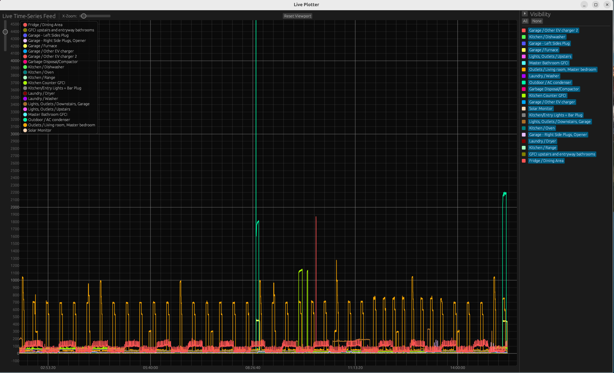

# Live Plotter

This is an implementation of a "live data plotter."  Think of the
strip charts that are generated by a seismometer.  Or those generated
by the lie detectors that you see in the movies.

This is like those.

An external program generates/provides the time-series data values to
be plotted with `live_plotter`.  The measurement values are real
numbers, and all the values must be present, separated by a space, on
a single line for each time step.  Labels should be specified for each
of the time-series data, and the number of labels must match the
number of numbers per line of input.  If the `--timestamp` command
line argument is specified, then the number of numbers should be one
greater, with the first number representing the timestamp value in
seconds since the Unix epoch.

Unlike real strip charts with paper tape made for Turing machines, the
display area is finite, and the `--viewport-width` command line
argument specifies how many most-recent time values to show in the
default view.  The `--max-points` parameter specifies how many data
points to retain per time-series data stream, and you can click-drag
to scroll the viewport to see older data.  The GUI also allows zooming
into a smaller region, so it would be feasible to specify a huge
number of sample times and just zoom into the most recent.  After
zooming, double clicking resets the view to show everything.  A `reset
view` button resets the display to the default viewport-width wide
view.  Hovering over a data point shows the data values and the name
of the time-series to which it belongs.  A visibility panel is
available on the right so that you can turn individual time-series
lines off (invisible) and on to get rid of or at least attempt to
control the clutter.



## Disclaimer

The code in this repo is entirely vibe coded using
http://aistudio.google.com/.  The only manual thing done other than
cutting-and-pasting the AI Studio generated code into the repository
is occasionally remembering to run `rustfmt`; the Studio generated
code sometimes has extraneous trailing spaces and the like.

There appears to be an issue with one or more of `eframe`, `egui`, and
`egui_plot` where even though no data is updating and you are not
clicking and dragging the chart, by just moving the mouse over the
chart area, you can get the program to spin and chew up most of a CPU
core.  As of this writing, AI Studio doesn't seem to understand how to
use a more recent version of these graphical UI packages than 0.29
(the API isn't stable), and I haven't tried to figure out of the
latest 0.34 version of these packages still have this performance
issue.

## Usage

```
$ span_circuit_info  -a --abs -k instantPowerW --live 5 --timestamp | eval live_plotter --timestamp --labels $(span_circuit_info -a -k name -q)
```

See https://github.com/bennetyee/span_circuit_info for `span_circuit_info`.
